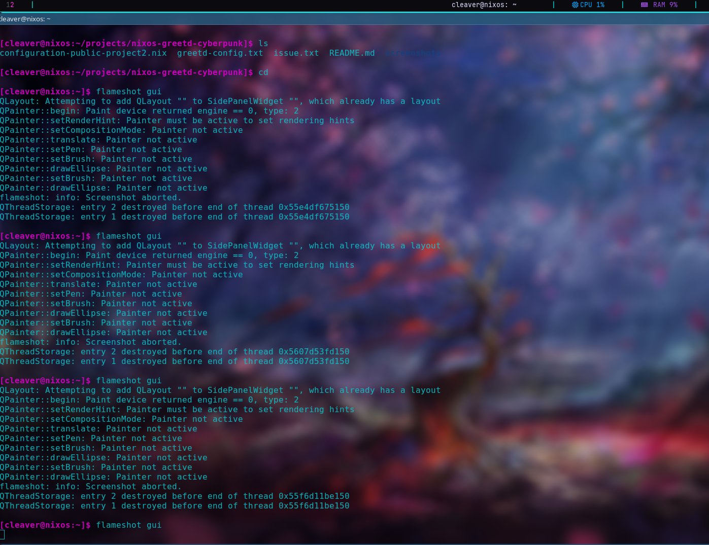

## NIXOS CYBERPUNK LOGIN SYSTEM (greetd + tuigreet)

## Overview
This project implements a minimal, security-conscious login system on NixOS using greetd and tuigreet, replacing traditional graphical display managers. The goal was to design a clean, reproducible, and low attack surface authentication flow while maintaining a cohesive cyberpunk-inspired terminal aesthetic.

## Screenshots
  Login Screen (greetd + tuigreet)
  - 

  i3 Desktop
  - 

This project demonstrates:
  - Linux system design and debugging
  - Display manager replacement and customization
  - Security-focused decision making
  - Declarative configuration using NixOS

## Features
  - Terminal-based login UI using 'tuigreet'
  - Lightweight display manager (greetd)
  - Custom login banner (/etc/issue)
  - Controlled session startup (startx -> i3)
  - Fully declarative NixOS configuration
  - Consistent cyberpunk-inspired terminal styling

## Security Design & Considerations
1. Minimal Display Stack
   Instead of using a full desktop display manager such as SDDM or GDM, this system uses greetd and tuigreet, which:
   - Reduces dependency complexity
   - Avoids large graphical login stacks
   - Limits potential vulnerabilities in the authentication path

2. Controlled Session Execution
   User sessions are explicitly defined and launched via:
   - tuigreet --cmd startx

   This ensures:
   - No unintended session execution
   - Clear separation between authentication and user environment
   - Predictable and reproducible login behavior

3. No Network-Exposed Services
   - No remote access services (e.g., SSH, RDP, VNC) are enabled by default
   - The system avoids unnecessary listening services
   - Networking managed locally via NetworkManager

4. Principle of Least Privilege
   - Standard user operates without elevated privileges
   - Administrative access restricted to the wheel group via sudo
   - Automatic login disabled

5. Reproducibility & Integrity (NixOS)
   - Declarative, version-controlled configuration
   - Changes are auditable and reversible
   - Reduces configuration drift and misconfiguration risk

6. Authentication Flow Simplicity
   - Login occurs in a controlled TTY environment
   - No complex GUI layers between credential input and PAM
   - Reduces risk of UI-based attack vectors

7. Trade-Offs
   - Terminal-based login limits advanced graphical customization
   - Additional configuration is required for full desktop environment features

These trade-offs were intentionally accepted to prioritize security, transparency, and system control.

## Setup/Usage
1. Enable greetd

services.greetd = {
  enable = true;
  settings = {
    default_session = {
      command = ''
	${pkgs.tuigreet}/bin/tuigreet \
	  --time \
	  --remember \
	  --asterisks \
	  --greeting "Authentication Required" \
	  --cmd startx
      '';
      user = "greeter";
    };
  };
};

2. Configure X11 + i3
     services.xserver.enable = true;
     services.xserver.windowManager.i3.enable = true;
     services.xserver.displayManager.startx.enable = true;

3. Create login banner
   - cat /etc/issue
   - Customizable with ANSI styling as desired

4. Rebuild system
   - sudo nixos-rebuild switch

## Lessons Learned
   - Debugging display managers requires understanding TTY vs graphical login flows
   - Simpler systems are often more stable and secure
   - greetd provides more control than traditional display managers
   - Declarative systems (NixOS) make experimentation safer via rollbacks
   - Not all customization paths justify added complexity

## Future Improvements
   - Optional Wayland-based graphical greeter (e.g., gtkgreet)
   - Expanded system theming (i3, Polybar, Rofi)
   - Hardened remote access configuration (SSH with key-based authentication)
