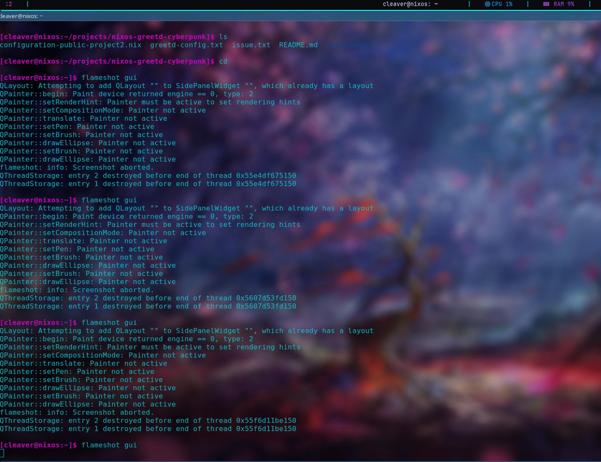

## NIXOS CYBERPUNK LOGIN SYSTEM (greetd + tuigreet)
A minimal, security-focused login system built on NixOS using greetd and tuigreet, replacing traditional graphical display managers with a controlled, low-attack-surface authentication flow.

## Overview
This project implements a lightweight login architecture designed to reduce system complexity while maintaining full control over authentication and session startup.

Instead of relying on full graphical display managers, this system uses a terminal-based login interface backed by a declarative NixOS configuration, prioritizing reproducibility, transparency, and security.

## Screenshots
### Login Screen (greetd + tuigreet)
  - 

### i3 Desktop Environment
  - 

This project demonstrates:
  - Linux system design and debugging
  - Display manager replacement and customization
  - Security-focused decision making
  - Declarative configuration using NixOS

## Key Features
  - Terminal-based login UI using 'tuigreet'
  - Lightweight display manager ('greetd')
  - Custom login banner via '/etc/issue'
  - Controlled session startup ('startx -> i3')
  - Fully declarative NixOS configuration
  - Consistent cyberpunk-inspired terminal styling

## Security Design & Considerations
1. Minimal Display Stack
   Replaced traditional display managers (e.g., SDDM, GDM) with a minimal alternative:
   - Reduces dependency complexity
   - Eliminates large GUI authentication layers
   - Lowers attack surface in the login path

2. Controlled Session Execution
   User sessions are explicitly defined:
   - tuigreet --cmd startx

   This ensures:
   - No unintended session execution
   - Clear separation between authentication and environment
   - Predictable and reproducible login behavior

3. No Network-Exposed Services
   - No remote access services enabled (e.g., SSH, RDP, VNC)
   - No unnecessary listening services
   - Networking handeled locally via NetworkManager

4. Principle of Least Privilege
   - Standard user operates without elevated privileges
   - Administrative access restricted to the 'wheel' group via 'sudo'
   - Automatic login disabled

5. Reproducibility & Integrity (NixOS)
   - Declarative, version-controlled system configuration
   - Changes are auditable and reversible
   - Reduces configuration drift and misconfiguration risk

6. Authentication Flow Simplicity
   - Login occurs in a controlled TTY environment
   - No complex GUI layers between credential input and PAM
   - Reduces risk of UI-based attack vectors

7. Trade-Offs
   - Limited graphical customization compared to full display managers
   - Requires manual configuration for desktop integration

These trade-offs were intentionally accepted to prioritize control, security, and system transparency.

## Real-World Relevance
This project reflects real-world Linux and security engineering practices:
  - Designing systems with reduced attack suface
  - Eliminating unnecessary services in authentication paths
  - Controlling system entry points and session behavior
  - Building reproducible infrastructure using declarative configuration

These principles are directly applicable to:
  - Hardened Linux environments
  - Server and minimal desktop systems
  - Infrastructure and security-focused engineering roles

## Setup/Usage
1. Enable greetd

'''nix
- services.greetd = {
  - enable = true;
  - settings = {
    - default_session = {
      - command = ''
	- ${pkgs.tuigreet}/bin/tuigreet \
	    --time \
	    --remember \
	    --asterisks \
	    --greeting "Authentication Required" \
	    --cmd startx
      - '';
      - user = "greeter";
    - };
  - };
- };

2. Configure X11 + i3
   - services.xserver.enable = true;
   - services.xserver.windowManager.i3.enable = true;
   - services.xserver.displayManager.startx.enable = true;

3. Create login banner
   - cat /etc/issue
   - Customizable with ANSI styling as desired

4. Apply Configuration
   - sudo nixos-rebuild switch

## Lessons Learned
   - Display manager debugging requires understanding TTY vs graphical login flows
   - Simpler systems are often more stable and secure
   - greetd provides greater control than traditional display managers
   - Declarative systems (NixOS) make experimentation safer via rollbacks
   - Not all customization paths justify added complexity

## Future Improvements
   - Optional Wayland-based greeter (gtkgreet)
   - Expanded system theming (i3, Polybar, Rofi)
   - Hardened remote access configuration (SSH with key-based authentication) 
